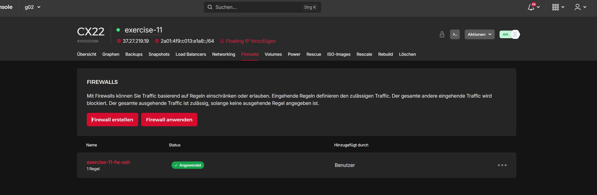

# Exercise 11: Incrementally creating a base system

> Click [here](https://github.com/DWalz/sdi-25/tree/main/exercise11) to view the solution in the repository.

## Minimal Configuration and Basics

The minimal configuration contained in the mentioned figure has been
copied into the file `main.tf`. Running `terraform init` initializes the [provider module from the Hetzner Cloud](https://registry.terraform.io/providers/hetznercloud/hcloud/latest) specified at the
top of the file. This allows us to use all the definitions of Hetzner in
[Terraform](https://developer.hashicorp.com/terraform) to manage the server infrastructure of the project via
Terraform.

The [`hcloud_server` resource](https://registry.terraform.io/providers/hetznercloud/hcloud/latest/docs/resources/server) which is specifying a server instance in
ouc configuration has been renamed to `exercise_11` for better
identification. Running `terraform plan` right now, Terraform will us inform of changes it will make to the
current configuration present in the cloud. The proposed changes follow
the specifications made in the configuration:

```txt
$ terraform plan
...
Terraform will perform the following actions:

  # hcloud_server.exercise_11 will be created
  + resource "hcloud_server" "exercise_11" {
      + image                      = "debian-12"
      + name                       = "exercise-11"
      + server_type                = "cx22"
      + ipv4_address               = (known after apply)
      ...
    }

Plan: 1 to add, 0 to change, 0 to destroy.
```

## Adding the SSH Firewall

To add an SSH firewall to the server a [`hcloud_firewall` resource](https://registry.terraform.io/providers/hetznercloud/hcloud/latest/docs/resources/firewall) has to
be created which represents a firewall object in the Hetzner Cloud. The
firewall has to have a single inbound rule for TCP traffic on port 22:

```tf
resource "hcloud_firewall" "fw_ssh" {
  name = "exercise-11-fw-ssh"
  rule {
    description = "SSH inbound"
    direction   = "in"
    protocol    = "tcp"
    port        = 22
    source_ips  = ["0.0.0.0/0", "::/0"]
  }
}
```

Important to notice here is that the rule also has to specify the
`source_ips` which is the list of allowed IPs that the SSH traffic may
be sent from. Setting them to `0.0.0.0/0` for IPv4 and `::/0` for IPv6
addresses respectively allows any sender on the internet to send SSH
packets to the server.

To apply the firewall to the server, it has to be connected to it in the
terraform configuration. The `hcloud_server` resource has the field
`firewall_ids` which can be used to provide a list of IDs of firewalls
to apply to that server. The firewall resource that has been created is
passed into this list to apply the firewall to the server. Terraform
allows us to reference the field of other resources by reference to fill
them out once they become available. This means there is no need for
manually transferring the ID of a created firewall resouce to the server
resource definition:

```tf
resource "hcloud_server" "exercise_11" {
  name         = "exercise-11"
  image        = "debian-12"
  server_type  = "cx22"
  firewall_ids = [hcloud_firewall.fw_ssh.id]
}
```



## Applying the Configuration to the Cloud

Running `terraform plan` will once again show changes that will be made to the infrastructure. In
this case there will be two resources created: The firewall and the
server resource. With `terraform apply` the planned configuration will then be acted upon and will be created in
the Hetzner Cloud.

In the Cloud Console the created server and firewall can now be
observed. The server has an IP of `37.27.219.19` and the applied
firewall can be seen. Pinging the server now would **fail**, since there is
**no ICMP firewall** configured for the server which would allow any ping
traffic to it. The only way to reach it would be via SSH using `ssh root@37.27.219.19`.

Sadly, the automatic E-Mail was never sent to the E-Mail account
provided to Hetzner and therefor the root password was unknown. It can
be reset using the `Rescue` tab in the Cloud Console to still connect to
the server. A way better option however is to provide a SSH key to the
server upon creation like in [Exercise 1](./exercise01.md).

## Version Control and Secrets

Currently the private API token for the Hetzner API is readable in plain
text inside the `main.tf` file, making it unable to be used in version
control like [`git`](https://git-scm.com/). To circumvent the issue the token has to be specified
as a variable which can then be used in the initialization of the
`hcloud` provider. This makes it possible to load the variable from
another file and then apply it without it ever having to be present in
the configuration file:

```tf
variable "hcloud_api_token" {
  description = "API token for the Hetzner Cloud"
  type        = string
  sensitive   = true
}
```

This variable can now be used instead of the hardcoded value inside the
`hcloud` provider:

```tf
provider "hcloud" {
  token = var.hcloud_api_token
}
```

Now the variable only has to be specified. Right now when using `terraform apply` Terraform will ask for the value of the variable:

```txt
$ terraform apply
var.hcloud_api_token
    API token for the Hetzner Cloud

    Enter a value:
```

We can either input the API token every time using the CLI or
alternatively use a `*.tfvars` file to specify the variables. In this
case the file `secrets.tfvars` is used to provide a value to the
`hcloud_api_token`: `hcloud_api_token = "..."` The variable file has to be loaded during the application using `terraform apply -var-file=secrets.tfvars`. To prevent the necessity of having to provide the file every time a
Terraform command has to be used, the variable file can also be named
`*.auto.tfvars` to load them automatically. This way the usage of
Terraform remains simple.

Now the `*.tfvars` files can be excluded from versioning to keep any
sensitive information outside of version control.

## SSH Passwordless Login

To be able to log in to the server without using a password we have to
add the public key of the local machine to the server’s
`authorized_keys` file. To register a SSH key in the Hetzner Cloud the
[`hcloud_ssh_key`](https://registry.terraform.io/providers/hetznercloud/hcloud/latest/docs/resources/ssh_key) resource is used. In it the `public_key` can be
provided from either a file or as a string:

```tf
resource "hcloud_ssh_key" "dw084_ssh_key" {
  name       = "dw084-ssh-key"
  public_key = file("~/.ssh/id_ed25519.pub")
}
```

This SSH key can then be added to the server using the `ssh_keys` field
in which a list of `hcloud_ssh_key` IDs can be specified to be added to
the respective server:

```tf
resource "hcloud_server" "exercise_11" {
  ...
  ssh_keys     = [hcloud_ssh_key.dw084_ssh_key.id]
}
```

After using `terraform apply` to create the infrastructure the login into the server works without
having to enter any passwords:

```txt
$ ssh root@37.27.219.19
...
root@exercise-11:~#
```

## Creating Outputs for Server Properties

Some properties of created resources like the server’s IP can’t be known
before applying the configuration. After the creation these values will
become known to Terraform and can be displayed using a file named
`outputs.tf`.

In this file there may be arbitrary `output` sections created. They all
have a `value` which may reference any static or dynamic values to
display after successful usage of the `terraform apply` command. To display the IP and datacenter of the created server the
`ipv4_address` and `datacenter` attribute of the `hcloud_server`
resource are used respectively:

```tf
output "server_ip" {
  description = "IP of the server created in exercise 11"
  value       = hcloud_server.exercise_11.ipv4_address
}

output "server_datacenter" {
  description = "Datacenter of the server created in exercise 11"
  value       = hcloud_server.exercise_11.datacenter
}
```

Now these two values are being displayed when running `terraform apply` :

```txt
$ terraform apply
...
server_datacenter = "hel1-dc2"
server_ip = "37.27.219.19"
```
