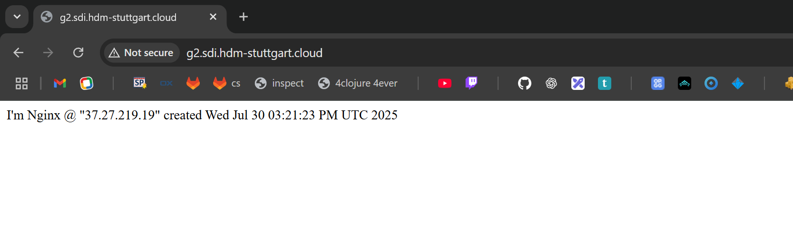

# Exercise 18: Enhancing your web server

> Click [here](https://github.com/DWalz/sdi-25/tree/main/exercise18) to view the solution in the repository.

## Adding a DNS Entry for the Web Server

Reaching the web server using the IP is possible but not very convenient.
To be able to use a normal URL a DNS record for that URL has to be created in a DNS server which will then tell the browser (or other applications) what the IP address of a given URL resolves to.

In this exercise this is done manually in order to get an understanding of the workings of the DNS process.

To change a DNS entry there are two requirements: The secret key of the zone that is being edited (in this case `g2.sdi.hdm-stuttgart.cloud.`) and the IP of the server we want to edit DNS entries for.
The secret key is provided from the Moodle course and is loaded into the environment for easier handling:

```txt
$ export HMAC=hmac-sha512:g2.key:kEndmvYk...
$ echo $HMAC
hmac-sha512:g2.key:kEndmvYk...
```

The IP can be retrieved as an output of the `terraform apply`:

```txt
$ terraform apply
...
Outputs:

server_datacenter = "hel1-dc2"
server_ip = "37.27.219.19"
volume_device = "/dev/disk/by-id/scsi-0HC_Volume_102991148"
```

With both of thos requirements satisfied a DNS record can be created.
There are multiple different types of DNS records.
The most simple form of them is a *DNS A record*.
It links a domain name to an IP address and consists of 4 parts: The domain name, a time to live, the type of record (`A`) and the IP the domain resolves to.

The time to live indicates to any machine or application that retrieves this record for how long it is valid and should be cached.
Computers usually don't request DNS resolution from the DNS servers all the time but only if a domain unknown to them is being requested.
The time to live is the time the record remains "known" to the computer before it is re-requested.
If the record is updated with a new IP during this time, the update won't propagate to the computer as long as the record has not yet expired, only after that is the record being requested again and the update received.
For the purpose of testing and being able to notice updates quickly a TTL of `10` (seconds) is used.

The program `nsupdate` can be used to interactively add records to a given DNS server.
In this case two `A` records are being created: One for `www.g2.sdi.hdm-stuttgart.cloud` and one for `g2.sdi.hdm-stuttgart.cloud` both pointing to the IP of the server:

```txt
$ nsupdate -y $HMAC
> server ns1.hdm-stuttgart.cloud
> update add www.g2.sdi.hdm-stuttgart.cloud 10 A 37.27.219.19
> update add g2.sdi.hdm-stuttgart.cloud 10 A 37.27.219.19
> send
> quit
```

The records can now be accessed when looking up those two domains.
The `dig` utility cen be used to request DNS records from a DNS server.
The lookup from the `ns1.hdm-stuttgart.cloud` DNS server that was used to register the records is successful.

It is also interesting to note that the entries can also be found by requesting the domain from Google's DNS server (`8.8.8.8`) even though only the HdM DNS server has been updated.
This is due to the structure of the DNS system: It is possible for another DNS server to have control over a specific domain.
In the "parent" DNS server there then is a *`NS` record* which will redirect all DNS requests of this domain (or subdomains) to the DNS server stated in the record.

```txt
$ dig +noall +answer @ns1.hdm-stuttgart.cloud www.g2.sdi.hdm-stuttgart.cloud
www.g2.sdi.hdm-stuttgart.cloud. 10 IN   A       37.27.219.19
$ dig +noall +answer @ns1.hdm-stuttgart.cloud g2.sdi.hdm-stuttgart.cloud
g2.sdi.hdm-stuttgart.cloud. 10  IN      A       37.27.219.19
$ dig +noall +answer @8.8.8.8 g2.sdi.hdm-stuttgart.cloud
g2.sdi.hdm-stuttgart.cloud. 10  IN      A       37.27.219.19
```

This results in the website hosted by our server not only being reachable at its IP but also via the domain `http://www.g2.sdi.hdm-stuttgart.cloud/` / `http://g2.sdi.hdm-stuttgart.cloud/`:



## Adding a TLS Certificate for HTTPS Access

Currently the website is served over HTTP which is unencryped - meaning that request and response are transmitted in clear text over the internet.
This is insecure for obvious reasons and most browsers today will per default block the access to domains over HTTP.
For that reason it is important to secure the traffic to our domain using a TLS certificate - allowing the users to reach the website over HTTPS.

The non-profit organisation *Let's encrypt* provides free TLS certificates using an automated API making it easy to secure traffic to a website using HTTPS.
In the following section the utility program `certbot` is used to request, receive and apply such a certificate to our `nginx` server.
The [step-by-step guide at digitalocean](https://www.digitalocean.com/community/tutorials/how-to-secure-nginx-with-let-s-encrypt-on-debian-11) is followed.

The first step is to install `certbot` and the `certbot-nginx` extension to be able to automatically apply the acquired certificate on the `nginx` server using `sudo apt -y install certbot python3-certbot-nginx`.
The next step is move the hosted website to a server block in `nginx` that corresponds with the domain `g2.sdi.hdm-stuttgart.cloud` and configure that server block to be served whenever the website is requested over the domain.
For that the file `/etc/nginx/sites-available/g2.sdi.hdm-stuttgart.cloud` is created and in it the server block is defined:

```txt
devops@exercise-18:~$ cat /etc/nginx/sites-available/g2.sdi.hdm-stuttgart.cloud
server {
        listen 80;
        listen [::]:80;

        root /var/www/g2.sdi.hdm-stuttgart.cloud/html;
        index index.html index.htm index.nginx-debian.html;

        server_name g2.sdi.hdm-stuttgart.cloud www.g2.sdi.hdm-stuttgart.cloud;

        location / {
                try_files $uri $uri/ =404;
        }
}
```

`nginx` structures websites into `sites-available` and `sites-enabled`.
`sites-available` holds all the configurations but they are not applied and actually served - it is basically a playground for configurations where they can be tested and created without any risk of breaking the served sites.
If the configuration is ready and the site should be served a symlink to the configuration is created in `sites-enabled`.
`nginx` will then serve the files that folder.
The serve directory is also changes from `/var/www/html` to `/var/www/g2.sdi.hdm-stuttgart.cloud/html` where a similar `index.html` to the default one has been created.
In the `nginx.conf` the `server_names_hash_bucket_size` line was also uncommented to avoid conflicts regarding the amount of domain names.

```txt
devops@exercise-18:~$ sudo nginx -t
nginx: the configuration file /etc/nginx/nginx.conf syntax is ok
nginx: configuration file /etc/nginx/nginx.conf test is successful
devops@exercise-18:~$ sudo systemctl restart nginx
```

After successfully restarting `nginx` the certificate can be requested from *Let's encrypt* using `certbot`.
To check if the request would be successful and to respect the rate limits of *Let's encrypt* a dry run is done first using the `--test-cert` option.
This requests a certificate from the staging environment of *Let's encrypt* which is not connected to the main certificate authority.

```txt
devops@exercise-18:~$ sudo certbot --nginx --test-cert -d g2.sdi.hdm-stuttgart.cloud -d www.g2.sdi.hdm-stuttgart.cloud
Saving debug log to /var/log/letsencrypt/letsencrypt.log
Requesting a certificate for g2.sdi.hdm-stuttgart.cloud and www.g2.sdi.hdm-stuttgart.cloud

Successfully received certificate.
Certificate is saved at: /etc/letsencrypt/live/g2.sdi.hdm-stuttgart.cloud/fullchain.pem
Key is saved at:         /etc/letsencrypt/live/g2.sdi.hdm-stuttgart.cloud/privkey.pem
This certificate expires on 2025-10-28.
These files will be updated when the certificate renews.
Certbot has set up a scheduled task to automatically renew this certificate in the background.

Deploying certificate
Successfully deployed certificate for g2.sdi.hdm-stuttgart.cloud to /etc/nginx/sites-enabled/g2.sdi.hdm-stuttgart.cloud
Successfully deployed certificate for www.g2.sdi.hdm-stuttgart.cloud to /etc/nginx/sites-enabled/g2.sdi.hdm-stuttgart.cloud
Congratulations! You have successfully enabled HTTPS on https://g2.sdi.hdm-stuttgart.cloud and https://www.g2.sdi.hdm-stuttgart.cloud
```

After the test run has run successfully the `--test-cert` option can be omitted to request the real certificate.
The on the test run received certificate has to be replaced with the real one.
After that the TLS certificate is successfully installed and `certbot` also configures the `nginx` server block for the domain correctly.

```txt
devops@exercise-18:~$ sudo certbot --nginx -d g2.sdi.hdm-stuttgart.cloud -d www.g2.sdi.hdm-stuttgart.cloud
Saving debug log to /var/log/letsencrypt/letsencrypt.log
Certificate not yet due for renewal

You have an existing certificate that has exactly the same domains or certificate name you requested and isn't close to expiry.
(ref: /etc/letsencrypt/renewal/g2.sdi.hdm-stuttgart.cloud.conf)

What would you like to do?
- - - - - - - - - - - - - - - - - - - - - - - - - - - - - - - - - - - - - - - -
1: Attempt to reinstall this existing certificate
2: Renew & replace the certificate (may be subject to CA rate limits)
- - - - - - - - - - - - - - - - - - - - - - - - - - - - - - - - - - - - - - - -
Select the appropriate number [1-2] then [enter] (press 'c' to cancel): 2
Renewing an existing certificate for g2.sdi.hdm-stuttgart.cloud and www.g2.sdi.hdm-stuttgart.cloud

Successfully received certificate.
Certificate is saved at: /etc/letsencrypt/live/g2.sdi.hdm-stuttgart.cloud/fullchain.pem
Key is saved at:         /etc/letsencrypt/live/g2.sdi.hdm-stuttgart.cloud/privkey.pem
This certificate expires on 2025-10-28.
These files will be updated when the certificate renews.
Certbot has set up a scheduled task to automatically renew this certificate in the background.

Deploying certificate
Successfully deployed certificate for g2.sdi.hdm-stuttgart.cloud to /etc/nginx/sites-enabled/g2.sdi.hdm-stuttgart.cloud
Successfully deployed certificate for www.g2.sdi.hdm-stuttgart.cloud to /etc/nginx/sites-enabled/g2.sdi.hdm-stuttgart.cloud
Your existing certificate has been successfully renewed, and the new certificate has been installed.

- - - - - - - - - - - - - - - - - - - - - - - - - - - - - - - - - - - - - - - -
If you like Certbot, please consider supporting our work by:
 * Donating to ISRG / Let's Encrypt:   https://letsencrypt.org/donate
 * Donating to EFF:                    https://eff.org/donate-le
- - - - - - - - - - - - - - - - - - - - - - - - - - - - - - - - - - - - - - - -
```

In the end it can also be useful to check if the renewals of the certificate using `certbot` is working normally.
For this the `--dry-run` option can be specified:

```txt
devops@exercise-18:~$ sudo certbot renew --dry-run
Saving debug log to /var/log/letsencrypt/letsencrypt.log

- - - - - - - - - - - - - - - - - - - - - - - - - - - - - - - - - - - - - - - -
Processing /etc/letsencrypt/renewal/g2.sdi.hdm-stuttgart.cloud.conf
- - - - - - - - - - - - - - - - - - - - - - - - - - - - - - - - - - - - - - - -
Simulating renewal of an existing certificate for g2.sdi.hdm-stuttgart.cloud and www.g2.sdi.hdm-stuttgart.cloud

- - - - - - - - - - - - - - - - - - - - - - - - - - - - - - - - - - - - - - - -
Congratulations, all simulated renewals succeeded:
  /etc/letsencrypt/live/g2.sdi.hdm-stuttgart.cloud/fullchain.pem (success)
- - - - - - - - - - - - - - - - - - - - - - - - - - - - - - - - - - - - - - - -
```

With that the website is successfully encrypted and can be reached over HTTPS after a respective firewall rule is added to the server's firewall:

```tf
resource "hcloud_firewall" "fw_exercise_18" {
  name = "exercise-18-fw"
  ...
  rule {
    description = "HTTPS inbound"
    direction   = "in"
    protocol    = "tcp"
    port        = 443
    source_ips  = ["0.0.0.0/0", "::/0"]
  }
}
```


