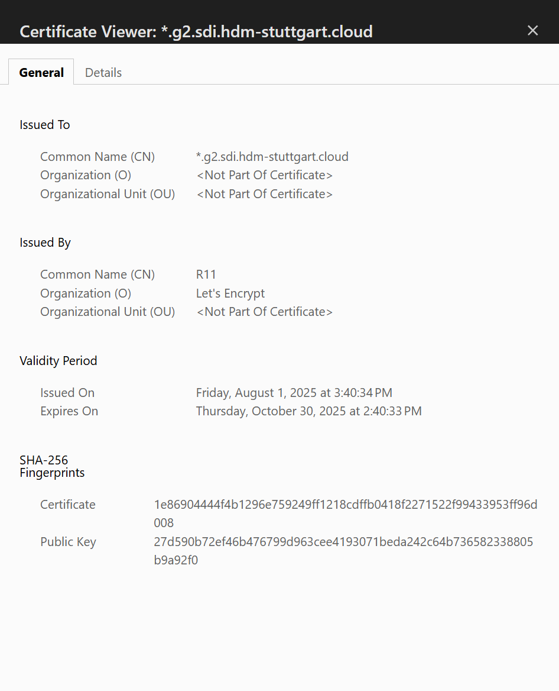

# Exercise 23: Testing your web certificate

> Click [here](https://github.com/DWalz/sdi-25/tree/main/exercise22) to view the solution in the repository.
>
> *Note:* The exercises 22 to 24 have been solved inside one configuration

We now want to apply the received certificate to the `nginx` server of our configuration in order to be able to connect using HTTPS.
This has been done manually before in [Exercise 18](./exercise18.md).
Now instead of doing it by hand and letting `certbot` handle the setup and modification of the `nginx` configuration, it is done using `cloud-init` to provision the server with the content.

With the `write_files` section both the certificate and certificate key files are transferred to the server.

```txt
${yamlencode({
  write_files = [{
    path = "/etc/nginx/ssl/private.pem"
    content = ssl_private
  }, {
    path = "/etc/nginx/ssl/certificate.pem"
    content = ssl_certificate
  }, {
    path = "/etc/nginx/sites-available/default"
    content = nginx_configuration
  }]
})}
```

Additionally a correct `nginx` configuration file replaces the default `/etc/nginx/sites-available/default` configuration.
It has HTTPS enabled and references the certificate files transferred to the server:

```txt
server {
        listen 80 default_server;
        listen [::]:80 default_server;

        # SSL configuration
        listen 443 ssl default_server;
        listen [::]:443 ssl default_server;

        ssl_certificate /etc/nginx/ssl/certificate.pem;
        ssl_certificate_key /etc/nginx/ssl/private.pem;

        root /var/www/html;

        index index.html index.htm index.nginx-debian.html;

        server_name _;

        location / {
                try_files $uri $uri/ =404;
        }
}
```

In the `runcmd` section the `nginx` service is restarted in order for the changed configuration to take effect using `systemctl restart nginx`.

After running `terraform apply` to apply the configuration using the staging server first, an apply with the real server (`https://acme-v02.api.letsencrypt.org/directory`) produces a valid TLS certificate.
It can be inspected in most browsers on the left of the search bar:

